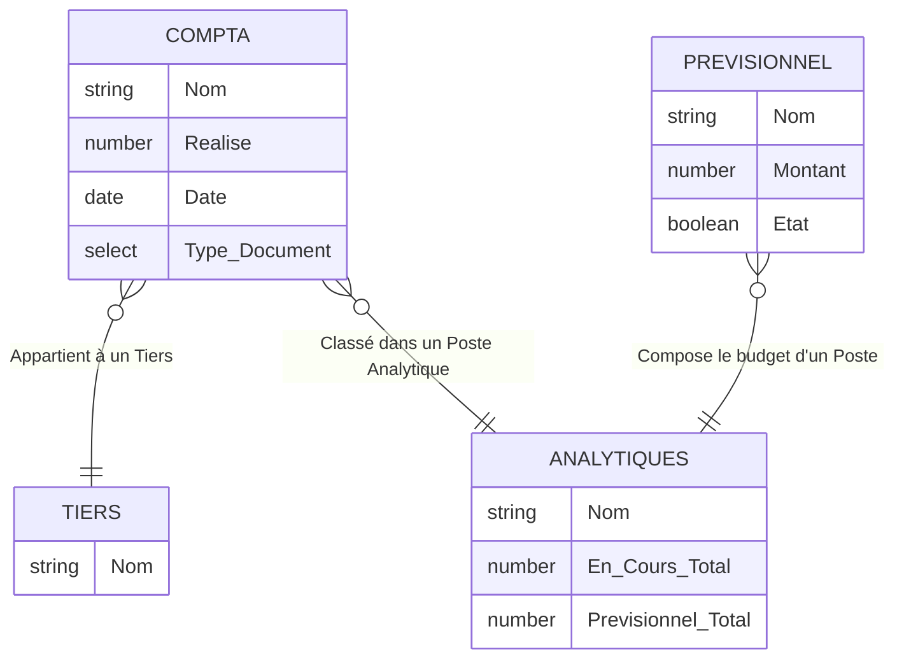

# Architecture de la Comptabilité Notion (Saison 2025-26)

L'architecture actuelle de votre système de comptabilité sur Notion repose sur **4 bases de données interconnectées**. Le modèle de données est très cohérent et ressemble à une structure ERP / Comptabilité Analytique classique.

## Vue d'ensemble des Bases de Données (Tables)

### 1. 💶 Compta 2025-26 DB (Le Grand Livre / Journal)
C'est la table principale où sont enregistrées toutes les transactions (dépenses, recettes).
- **🟪 Nom** : Titre ou libellé de l'opération.
- **Date** : Date de l'opération.
- **Réalisé** : Le montant réel de la transaction (en €).
- **Type de document** : Une liste déroulante pour classifier la pièce justificative *(Note de Frais, Facture, Remise de Chèques, Virement SEPA, etc.)*.
- **Commentaires** : Notes additionnelles.
- **🟪 Lien Google Drive** : Un lien URL vers la pièce jointe stockée sur le Drive.
- **Tiers TEXTE** *(Formule)* : Extrait le texte du Tiers lié pour un affichage plus propre.
- **Analytique TEXTE** *(Formule)* : Extrait le texte de la catégorie Analytique liée.
- **Boutons d'automatisation (n8n)** :
  - **🟪 Préparer le mail** *(Formule)* : Génère un lien webhook vers votre n8n pour déclencher la préparation d'un mail.
  - **🟪 Renommer** *(Formule)* : Génère un webhook n8n pour renommer et classer le document.

### 2. 🗂️ Analytiques 25-26 BD (Plan Comptable Analytique / Budgets)
Cette table sert à regrouper les flux financiers par catégorie ou projet (ex: Compétitions, Salaires, Matériel, etc.) et à suivre l'état du budget.
- **Nom** : Nom du poste analytique.
- **Description** : Détails sur ce poste.
- **En cours (A)** *(Formule)* : Fait la somme de tous les montants `Réalisé` liés depuis la base Compta.
- **Prévisionnel (€) (A)** *(Formule)* : Fait la somme de tous les montants prévus liés depuis la base Prévisionnel.
- **Tendance Numérique / Tendance** *(Formules)* : Calcule la différence (`En cours` - `Prévisionnel`) et l'affiche visuellement (en vert ou rouge selon le résultat).
- **Etat de tous les postes** & **Etats des postes** *(Formules)* : Affichent une liste avec des cases à cocher `☑`/`☐` pour savoir si tous les objectifs prévisionnels du poste sont remplis.

### 3. 🎯 Prévisionnel 25-26 DB (Lignes Budgétaires)
Cette table permet de définir les lignes budgétaires prévues qui vont composer le budget de chaque poste analytique.
- **Nom** : Libellé de la dépense/recette prévue.
- **Montant** : Montant prévu (en €).
- **État** *(Case à cocher)* : Permet de marquer si cette ligne prévisionnelle s'est réalisée ou si elle est validée.

### 4. 👥 Tiers 25-26 BD (Annuaire / Fournisseurs / Membres)
Base de données très simple qui sert de référentiel pour savoir "à qui" on donne l'argent ou "de qui" on le reçoit.
- **Nom** : Nom de la personne, du club, ou de l'entreprise.

---

## 🔗 Schéma des Relations (Liaisons)

Les relations entre ces tables sont la clé de voûte de votre architecture actuelle.

1. **Relation "Tiers" :** Chaque ligne de la `Compta` est liée à **1 Tiers** dans la base `Tiers BD`. *(Permet de savoir qui a payé / été payé)*.
2. **Relation "Analytique" :** Chaque ligne de la `Compta` est liée à **1 Poste Analytique** dans la base `Analytiques BD`. *(Permet d'alimenter la formule "En cours" du budget)*.
   - *Note : Le nom de la propriété dans votre base Analytique s'appelle `Compta 2024-25 DB (R)`, c'est un résidu de l'année dernière, mais elle pointe bien vers la table 25-26 !*
3. **Relation "Prévisionnel" :** Chaque ligne du `Prévisionnel` est liée à **1 Poste Analytique**. *(Permet de construire le budget cible de chaque poste)*.

---

## 🚀 Points clés pour la création de votre outil sur-mesure
Si l'on recrée ceci dans une base de données relationnelle classique (PostgreSQL, MySQL, ou Supabase/NocoDB) :
1. **Les Formules Notion** (sommes automatiques) devront être remplacées par des **requêtes SQL d'agrégation** (ex: `SUM(montant) GROUP BY analytique_id`) ou des **vues SQL** (Views).
2. **Les Webhooks n8n** : Au lieu de générer des clics sur des liens formulés comme dans Notion, votre future interface (Front-end) pourra simplement avoir de vrais boutons d'action qui appellent l'API n8n directement avec l'ID de la transaction en arrière-plan.
3. L'architecture est déjà très **normalisée** (il n'y a pas de duplication de données, chaque entité a sa table). Le passage à une vraie base de données sera très fluide.
