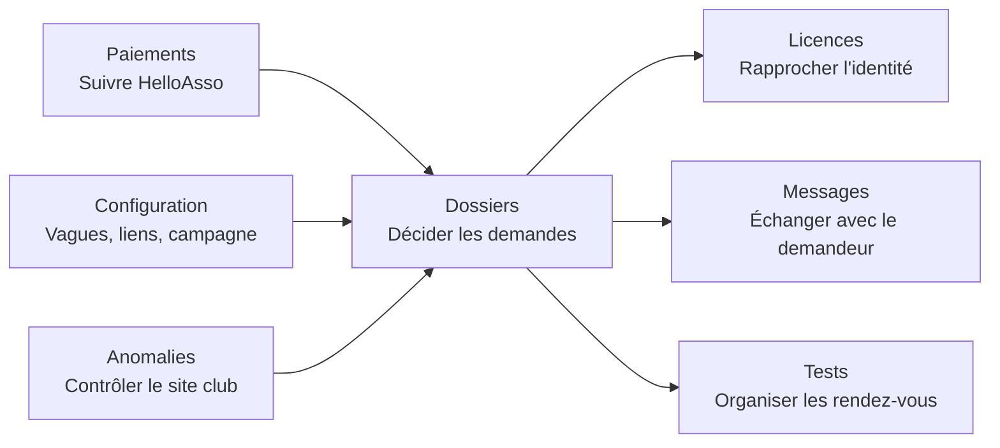

# Guide administrateur — onglets Abonnements escalade

Ce guide explique l'usage quotidien de l'espace
`/#/gestion-abonnements`. Il est destiné aux bénévoles possédant la tuile
**Abonnements escalade**. Cette tuile est indispensable, même pour une personne
ayant le rôle général « admin ».

> Les informations affichées par les onglets proviennent en partie du site du
> club, de l'annuaire des licences et de HelloAsso. Une information externe peut
> donc être absente ou ancienne tant qu'elle n'a pas été synchronisée.

## Vue d'ensemble

| Zone | But principal | Fréquence conseillée |
|---|---|---|
| Dossiers | Examiner et décider les demandes | À chaque nouvelle demande / quotidien en période d'ouverture |
| Messages | Répondre au demandeur depuis son dossier | Dès qu'un badge de message non lu apparaît |
| Paiements | Suivre les paiements du formulaire HelloAsso | Régulièrement après ouverture du paiement |
| Anomalies | Détecter les inscriptions directes non autorisées sur le site club | Après chaque synchronisation du site club |
| Licences | Rattacher chaque demande à la bonne licence | Avant ou pendant l'instruction des dossiers |
| Tests | Proposer et suivre les rendez-vous de test d'autonomie | Avant et pendant les sessions de test |
| Configuration | Préparer la campagne et ses liens | Au début de campagne ; reset uniquement en fin de campagne |

## 1. Dossiers

### À quoi sert cet onglet ?

**Dossiers** est le poste de pilotage des demandes. Un dossier est lié à une
adresse e-mail et peut contenir plusieurs personnes (par exemple une famille).
Les décisions se prennent **personne par personne**, et non seulement pour le
dossier entier.

En haut de l'écran se trouvent :

- une jauge du nombre de places ; elle est informative, elle ne bloque pas
  automatiquement les validations ;
- le bouton **Synchroniser le site club**, qui importe l'état actuel des
  abonnés et des élèves en cours ;
- un filtre par statut et une recherche par nom ou e-mail.

### Lire une carte dossier

Chaque carte montre le statut global, l'e-mail, la date de soumission, le
commentaire éventuel et les personnes de la demande.

- Le badge `💬` indique le nombre de messages non lus du demandeur.
- Le badge « en cours d'escalade » indique qu'une personne est reconnue dans
  l'export des cours ; c'est pertinent pour la priorité de vague 2.
- Cliquer le nom d'une personne ouvre son détail : licence, progression sur les
  étapes (licence, site, paiement, test…) et messagerie.

### Décider une demande

Pour chaque personne, utiliser l'un des boutons :

| Décision | Effet |
|---|---|
| **Valider** | La personne peut accéder à son parcours de finalisation et, si nécessaire, réserver un test. Un e-mail de statut est planifié. |
| **Liste d'attente** | La personne reste en attente ; elle n'accède pas à la finalisation comme une personne validée. |
| **Refuser** | La demande de cette personne est refusée ; un e-mail de statut est planifié. |

Le statut du dossier est calculé à partir de ses personnes. Un même dossier
peut donc contenir des situations différentes. Avant de valider, vérifier
manuellement le plafond de places et les informations de licence : ils ne sont
pas imposés automatiquement par l'application.

### Demandes supprimées

La section repliable **Demandes supprimées** est un historique léger des
dossiers retirés par leur demandeur. Elle donne une date, les personnes et
l'e-mail, mais ne permet pas de restaurer le dossier.

### Bon réflexe

Après une synchronisation réussie, traiter d'abord les nouveaux dossiers et
les messages non lus ; puis passer les personnes ambiguës par l'onglet
**Licences** avant de prendre une décision définitive.

## 2. Messages

### À quoi sert cet onglet ?

L'onglet **Messages** est la boîte de réception partagée des bénévoles. Le
badge placé à côté de son nom dans la barre d'onglets donne le total des
messages non lus. Par défaut, l'écran montre uniquement les conversations
**À traiter** ; le bouton **Toutes les conversations** élargit la liste.

Le fil est partagé entre le demandeur et tous les admins Abonnements. Il est
attaché au **dossier** et non à une personne : un message est donc commun à
tous les candidats d'un même dossier. Il reste également consultable depuis le
détail d'une personne dans l'onglet **Dossiers**.

### Utilisation

1. Ouvrir l'onglet **Messages**, puis cliquer **Voir et répondre** sur une
   conversation.
2. Lire le fil ; son ouverture marque les messages comme lus côté admin.
3. Saisir la réponse et cliquer **Envoyer**. `Ctrl + Entrée` (ou `Cmd + Entrée`
   sur macOS) envoie également le message.
4. Le demandeur voit la réponse en temps réel dans son portail.

### À utiliser pour

- demander une précision sur une licence ou une identité ;
- expliquer une liste d'attente ou un refus ;
- rappeler une démarche manquante ;
- prévenir d'un changement de rendez-vous.

Éviter d'y communiquer des données inutiles ou sensibles. Le fil est conservé
avec le dossier jusqu'à sa suppression ou au reset de campagne.

## 3. Paiements

### À quoi sert cet onglet ?

Il affiche le **cache du formulaire HelloAsso dédié aux abonnements**. Il ne
concerne ni les paiements de cours ni un autre formulaire du club.

Si aucun formulaire n'est lié, l'onglet demande de coller l'URL publique
HelloAsso. Après l'enregistrement, il faut lancer une synchronisation pour voir
les paiements remontés.

### Actions disponibles

- **Synchroniser maintenant** : actualise le cache HelloAsso du formulaire
  Abonnements.
- Filtrer par statut, rechercher un nom/e-mail, ou n'afficher que les problèmes
  de remboursement.
- Ouvrir le reçu et le reçu fiscal lorsqu'ils sont disponibles.
- **Rembourser** : copie l'e-mail du payeur quand possible, puis ouvre l'espace
  HelloAsso ; le remboursement est réalisé dans HelloAsso, pas dans cette
  application.
- Poser un statut de suivi interne : `à traiter`, `traité`, `en attente` ou
  `remboursé`, avec un commentaire si nécessaire.

### Point fondamental

Le statut posé dans cet onglet est un **suivi interne de l'équipe**. Il ne
modifie pas l'étape officielle de paiement affichée au demandeur ; celle-ci est
alimentée par les données du site du club après synchronisation. Ne pas
interpréter « traité » comme une validation automatique de l'abonnement.

## 4. Anomalies

### À quoi sert cet onglet ?

**Anomalies** est une liste de contrôle, en lecture seule. Elle recense les
personnes présentes dans le dernier snapshot du site club qui ne sont pas
légitimes pour la vague d'ouverture courante.

Selon la vague, une inscription est légitime si la personne est :

- un abonné validé de la saison précédente (vagues 0 et 1) ;
- ou un élève déjà en cours d'escalade (vague 2) ;
- ou, en vague 3, titulaire d'une demande validée dans le portail.

### Que faire d'une anomalie ?

1. Vérifier le nom, la licence et la raison affichée.
2. Vérifier si les données ont été synchronisées récemment ; un décalage peut
   expliquer une anomalie temporaire.
3. Si elle est confirmée, **rejeter l'inscription directement sur le site du
   club**. Cet onglet ne modifie aucune inscription externe.
4. Si elle correspond à une personne qui devrait être admise, corriger le canal
   manquant : dossier à valider, licence à rapprocher ou vague à ouvrir.

Les anomalies ne sont pas comptées dans la jauge des places et la liste se
réduit automatiquement quand une vague suivante ouvre de nouveaux droits.

## 5. Licences

### À quoi sert cet onglet ?

La licence est la clé de rapprochement entre une demande, le site du club et
les exports de cours. L'onglet montre les personnes dont la licence n'a pas pu
être reliée avec certitude.

Les correspondances exactes de nom/prénom — y compris dans l'ordre inversé —
sont résolues automatiquement. Les cas restants exigent un arbitrage humain.

### Procédure conseillée

1. Cliquer **Synchroniser l'annuaire des licences** si l'annuaire peut avoir
   changé ou si c'est le début de journée de traitement.
2. Cliquer **Relancer la résolution automatique** : cela peut résoudre les
   nouveaux cas exacts.
3. Pour chaque personne restante, examiner les candidats proposés et leur
   pourcentage de similarité.
4. Cliquer **Associer** uniquement lorsque l'identité est certaine ; sinon,
   saisir manuellement le numéro de licence à 12 chiffres puis associer.

> Ne jamais associer une licence sur la seule ressemblance d'un nom. Une erreur
> fausse le suivi de la licence, de l'inscription et potentiellement le
> rapprochement avec le site du club.

## 6. Tests

### À quoi sert cet onglet ?

L'onglet **Tests** organise les rendez-vous de test d'autonomie. Chaque
encadrant y déclare ses propres disponibilités ; les candidats réservent ensuite
des tranches calculées automatiquement à partir de l'ensemble des encadrants.

### Proposer une disponibilité

1. Choisir un jour, aujourd'hui ou dans le futur.
2. Dans la grille, cliquer une heure de début puis une heure de fin.
3. Vérifier le résumé et cliquer **Ajouter le créneau**.

Les limites appliquées sont : horaires alignés sur 20 minutes (`00`, `20`,
`40`), fin après début et durée minimale de 40 minutes. L'interface propose une
grille de 08:00 à 22:40.

Chaque encadrant apporte deux places par tranche de 20 minutes. Lorsque des
disponibilités se chevauchent, la capacité se cumule. Les candidats voient des
rendez-vous de 60 minutes en priorité, puis de 40 minutes, sans connaître
l'identité de l'encadrant.

### Mes créneaux et inscrits

- **Mes créneaux** : seuls vos créneaux y apparaissent. Vous pouvez supprimer
  uniquement ceux que vous avez créés.
- **Inscrits par créneau** : tous les admins Abonnements voient les rendez-vous
  actifs, avec le nom, le prénom et l'e-mail des candidats.

Avant de supprimer un créneau, tenir compte de l'avertissement : si la capacité
devient insuffisante, les derniers inscrits sont annulés en premier. Ils sont
invités à reprendre rendez-vous et un e-mail d'annulation est planifié.

### Limite actuelle : résultat du test

Cet onglet ne permet pas encore de cocher « réussi », « échoué » ou « absent ».
Le résultat doit actuellement être renseigné dans le site du club, puis ramené
dans le portail par synchronisation. Sans cette mise à jour externe, le suivi
du candidat ne peut pas passer automatiquement à « test validé ».

## 7. Configuration

Cet onglet modifie les paramètres communs à toute la campagne. Il doit être
réservé à un petit nombre de responsables ; les changements prennent effet pour
tous les admins et demandeurs concernés.

### Plafond de places

Le plafond alimente la jauge « X / plafond ». Il est modifiable à tout moment,
mais **il ne bloque aucune validation automatiquement**. Le responsable doit
donc contrôler l'occupation avant d'accepter un nouveau dossier.

### Liens des étapes d'inscription

Ces URL sont affichées à un demandeur validé dans son suivi : nouvelle licence,
renouvellement, activation de compte, demande d'abonnement sur le site du club
et formulaire de test.

Vérifier les liens dans un navigateur avant enregistrement. Le lien HelloAsso
de paiement est séparé : il est défini pour la campagne et ne se modifie qu'au
changement de saison.

### Dates des vagues

Les heures sont interprétées en heure de Paris.

| Vague | Public admis à déposer une demande via le portail |
|---|---|
| Vague 1 | Pas de demande dans le portail : les abonnés N-1 se réinscrivent directement sur le site du club. |
| Vague 2 | Élèves actuellement inscrits aux cours d'escalade, reconnus avec leur licence. |
| Vague 3 | Tout le monde. |

Laisser une date vide garde la vague fermée. La vague 2 doit impérativement
être antérieure à la vague 3. Ces dates sont à ressaisir à chaque campagne.

### Changer de saison — action irréversible

Cette opération doit être lancée **avant le premier scraping de la nouvelle
saison**, après validation de la conservation des données et du nouveau lien
HelloAsso. Elle :

- archive le snapshot actuel des abonnés en N-1 ;
- vide les snapshots, créneaux, réservations, cache de paiements et journal
  d'e-mails de la campagne ;
- programme la suppression des demandes et comptes publics ;
- conserve les comptes staff en théorie ;
- enregistre le nouveau lien HelloAsso et efface les dates de vagues.

> **Autorisation requise :** ne lancer le reset que lorsque les
> responsabilités de fin de campagne ont été validées. Le bouton n'est
> accessible qu'à l'administrateur général disposant à la fois de la tuile
> Abonnements et de l'autorisation nominative de reset, réglée dans
> **Configurations > Utilisateurs et Accès** par un autre administrateur. Il
> faut aussi s'assurer que les
> comptes publics et staff sont strictement séparés par e-mail. Un défaut connu
> peut sinon exposer un compte staff ayant aussi été utilisé dans le portail
> public à la purge. Voir [l'audit complet](10-audit-abonnements-escalade.md).

Après le reset, reconfigurer les vagues, contrôler les liens puis lancer les
synchronisations nécessaires avant de rouvrir la campagne.

## Routine opérationnelle minimale

1. Synchroniser le site du club, puis lire Dossiers et Anomalies.
2. Répondre aux messages non lus.
3. Résoudre les licences ambiguës avant validation.
4. Valider, mettre en attente ou refuser chaque personne selon la capacité
   réellement disponible.
5. Synchroniser et suivre les paiements séparément.
6. Vérifier que les créneaux de test couvrent les besoins et éviter leur
   suppression tardive.

Pour les règles de sécurité, la base de données et les limites connues, lire
aussi [l'audit fonctionnel complet](10-audit-abonnements-escalade.md).
